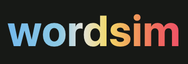

# wordsim

`wordsim` is a small game that scores guesses by semantic similarity, similar to Contexto or Semantle. An online version of the game is currently hosted at [cagrislist.org/projects/wordsim](https://cagrislist.org/projects/wordsim) using the code in this repository. The core game is a standalone static page with a vanilla TypeScript client, and all embeddings, cosine similarities, and proximity ranks are computed offline for responsiveness. This repository also includes a small Jekyll landing page for local previewing.

The demo contains English and Turkish collections, each with 160 puzzles currently: 20 each for animals, objects, actions, adjectives, foods, places, occupations, and clothing. For the generated puzzles, stable IDs and category assignments live in `pipeline/targets/en.json` and `pipeline/targets/tr.json`.

## Prerequisites

- Node.js 18 or newer
- Ruby 3.3 and Bundler
- Python 3.11 or newer
- A Hugging Face account with the [EmbeddingGemma terms](https://huggingface.co/google/embeddinggemma-300m) accepted when generating English data

## Install

```sh
npm install
bundle install
python3 -m venv game
source game/bin/activate
pip install -e .
hf auth login
```

Access to EmbeddingGemma is gated by Google's terms. Model weights and generated NumPy caches remain local and are ignored by Git; they are not included in Wordsim releases.

## Generate puzzle data

```sh
source game/bin/activate
python -m pipeline generate --collection embeddinggemma-768-en-v1
python -m pipeline fetch --collection word2vec-skipgram-300-tr-v1
python -m pipeline generate --collection word2vec-skipgram-300-tr-v1
python -m pipeline audit --collection embeddinggemma-768-en-v1 --limit 25
python -m pipeline audit --collection word2vec-skipgram-300-tr-v1 --limit 25
```

Generation performs the following work:

1. Selects and normalizes entries from `wordfreq`: the 30,000 most frequent valid English surface forms, or the reviewed Zeyrek-preprocessed Turkish vocabulary. See [the Turkish vocabulary documentation](docs/turkish-vocabulary.md) for the normalization rules and the `tr-overrides.json` lexical-review workflow.
2. Encodes the vocabulary with the collection's pinned extractor: prompted EmbeddingGemma for English or the static Word2Vec table for Turkish.
3. Stores normalized embeddings in `pipeline-cache/<collection-id>/embeddings.npy` for reuse.
4. Reads the language's 160 stable IDs, words, and categories from `pipeline/targets/` and verifies exactly 20 targets per category.
5. Writes a versioned vocabulary, collection manifest, and 160 minified puzzle tables under `wordsim/data/collections/<collection-id>/`, plus the shared `catalog.json`.

Useful generator options include `--device cuda`, `--batch-size N`, `--targets PATH`, and `--force`. A valid generated vocabulary and embedding cache can be reused without loading the model dependencies.

### Turkish Word2Vec model

In this current version, the published Turkish collection uses the 300-dimensional Word2Vec skip-gram vectors released with [A Comprehensive Analysis of Static Word Embeddings for Turkish](https://arxiv.org/abs/2405.07778).

```sh
source game/bin/activate
python -m pipeline fetch --collection word2vec-skipgram-300-tr-v1
python -m pipeline generate --collection word2vec-skipgram-300-tr-v1
python -m pipeline audit --collection word2vec-skipgram-300-tr-v1 --limit 25
```

## Build and run

```sh
npm run build:game
bundle exec jekyll serve
```

After these steps, you can access the game by visiting `http://localhost:4000/wordsim/`.

The repository intentionally is minimal and contains no deployment workflow. `npm run build:site` bundles the browser code and creates the local `_site/` output.

## Tests

```sh
npm test
source game/bin/activate
python -m unittest discover -s tests -p 'test_*.py'
npm run build:site
```

## Data format and future extractors

See [THIRD_PARTY_NOTICES.md](THIRD_PARTY_NOTICES.md) for model and vocabulary attribution.

## License

Wordsim's original code and documentation are available under the [MIT License](LICENSE). Generated vocabularies and ranking data incorporate outputs or data from third-party sources and remain subject to the attribution and applicable terms described in [THIRD_PARTY_NOTICES.md](THIRD_PARTY_NOTICES.md). The MIT License does not relicense those third-party materials.
